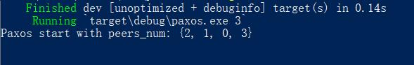
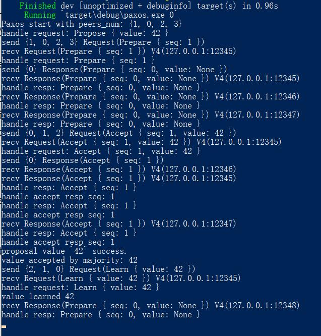
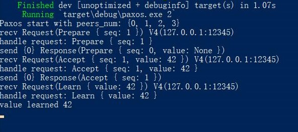

# paxos-rs

An implementation of paxos algorithm in rust, based on the paper "Paxos Made Simple".

This project is for learning purpose and praticing my rust programming. Its goal is to implement the paxos algorithm
as is discussed in "Paxos Made Simple", in which every server can start a proposal and finally all servers reach consensus
in a chosen value.

# Usage

Run this program in four different consoles with 1, 2, 3, 0 respectively as its parameter which denotes the server's id. 
(0 must be the last one to run since the 0th server will initiate the first request.)

Before the 0th server begin, you will see something like 

After the first proposal started, all the four servers learned the chosen value 42.

leader:

follower:

# Drawbacks

Sequence number isn't stored locally as required by the algorithm.

