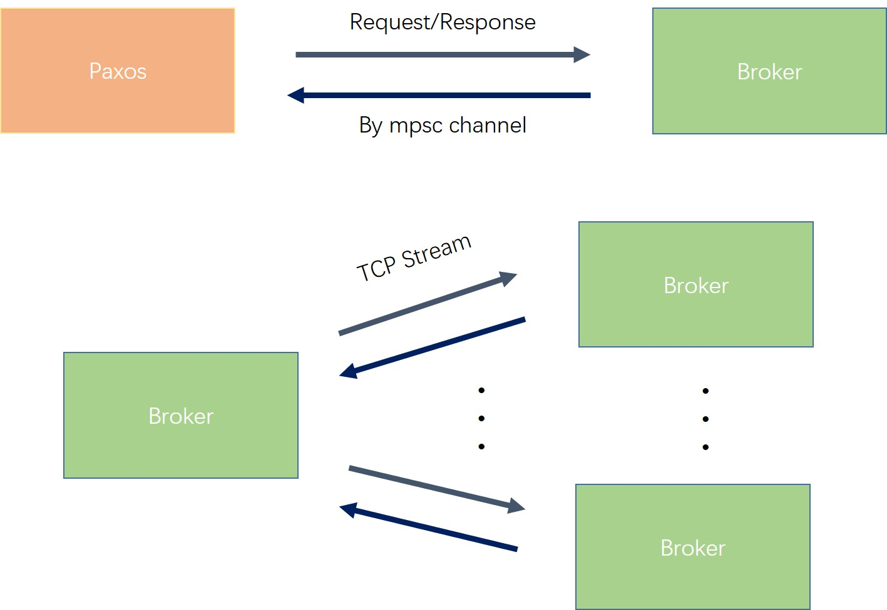

# paxos-rs
[](https://github.com/996icu/996.ICU/blob/master/LICENSE)

An implementation of paxos algorithm in rust, based on the paper "Paxos Made Simple".

This project is for learning purpose and praticing my rust programming skill. Its goal is to implement the paxos algorithm
as is discussed in "Paxos Made Simple", in which every server can start a proposal and finally all servers reach consensus
in a chosen value.


## Usage

```
cargo run
```

This will give you an interactive console. The currently supported commands are:
- `start server_num`
  - Lanuch `server_num` servers. This command should be sent first before `query` and `propose`.
- `query server_id`
  - Query the #`server_id` server for the chosen value. Notice that #`0` server is used as an improvised client, and it doesn't participated in this paxos game. Don't query it.
- `propose server_id value`
  - Let the #`server_id` server start a proposal with the provided `value`.
- `exit`
  - Exit the console.

All the commands above are case-insensitive, and can be used by their acronym. For examples:
- `s 5` for `start 5`
- `q 2` for `query 2`
- `p 2 42` for `propose 2 42`
- `x` for `exit`

After a command executed, servers will log requests and response they received. 
You can see how each node react during the prepare and accept round.

```
Paxos> start 3
Paxos> query 1
Server #1 handle req: Query from #0.
Server #0 handle resp: Query { val: None } from #1.
Server #1 Answer: not learn yet.
Paxos> propose 2 42                                        <---------------------------
Server #2 handle req: Propose { value: 42 } from #0.
Server #2 handle req: Prepare { seq: 3 } from #2.
Server #3 handle req: Prepare { seq: 3 } from #2.
Server #1 handle req: Prepare { seq: 3 } from #2.
Server #2 handle resp: Prepare(None) from #2.
Server #2 handle resp: Prepare(None) from #3.
Server #2 handle resp: Prepare(None) from #1.
Server #2 handle req: Accept { seq: 3, value: 42 } from #2.
Server #3 handle req: Accept { seq: 3, value: 42 } from #2.
Server #2 handle resp: Accept { seq: 3 } from #2.
Server #2 handle resp: Accept { seq: 3 } from #3.
proposal value `42` success.                               <---------------------------
value accepted by majority: 42
Server #2 handle req: Learn { value: 42 } from #2.
Server#2 learned 42
Server #3 handle req: Learn { value: 42 } from #2.
Server#3 learned 42
Server #1 handle req: Learn { value: 42 } from #2.
Server#1 learned 42
Paxos> propose 3 1024                                      <---------------------------
Server #3 handle req: Propose { value: 1024 } from #0.
Server #3 handle req: Prepare { seq: 4 } from #3.
Server #1 handle req: Prepare { seq: 4 } from #3.
Server #2 handle req: Prepare { seq: 4 } from #3.
Server #3 handle resp: Prepare(Some((3, 42))) from #3.
Server #3 handle resp: Prepare(None) from #1.
Server #3 handle resp: Prepare(Some((3, 42))) from #2.
Server #3 handle req: Accept { seq: 4, value: 42 } from #3.
Server #1 handle req: Accept { seq: 4, value: 42 } from #3.
Server #3 handle resp: Accept { seq: 4 } from #3.
Server #3 handle resp: Accept { seq: 4 } from #1.
proposal value `1024` fail, `42` is chosen.                <---------------------------
value accepted by majority: 42
Server #3 handle req: Learn { value: 42 } from #3.
Server#3 learned 42
Server #1 handle req: Learn { value: 42 } from #3.
Server#1 learned 42
Server #2 handle req: Learn { value: 42 } from #3.
Server#2 learned 42
Paxos> exit
```

## Network



## Problems

- Sequence number isn't stored locally as required by the algorithm.
- Currently, every message's transmission making a new tcp connection, it's not good. Rewrite it to reuse previous connections.

## 2020/6/23 Changelog
1. Resolve sequence number conflicts by adding a new `SequenceNumber` type which distinguish same sequence numbers by the server's id.
2. Use a type alias `ValueType` instead of the bare `u32`.


## 2020/6/20 Changelog
1. Update tokio version to 2.0, and rewrite the network component with async/await.
2. Use `#[derive(Serialize, Deserilize)]`  to encode/decode Datagram into/from binary, instead of handwriting this utility.
3. Rewrite the demo. Now you don't have to start many replicates to test the demo, all the servers can be launched at once.
4. Bug fixes. Some of these bugs are quite serious:
    1) When paxos receive a majority's acceptance, it broadcast the Learn request only to those who has just accepted instead of all the servers, causing those who didn't response swiftly ignorant to the consensus.
    2) Sequence numbers conflicts. The paxos algorithm require the number of proposal to be unique, but the naive way (for simplicity) used to generate sequence numbers can't guarantee this. This bug still exist, even though I changed it to a slightly more sophisticated way. It can be fixed by using distinct prime number steps or pairing the sequence number with server's local id.
    3) The most serious one that violate algorithm's safety: Replace the proposal's value with a higher-numbered but empty value during the prepare round. When the prepare finished, this empty value allowed the server to send accept request with arbitrary value to others, which led to divergent consensus.

